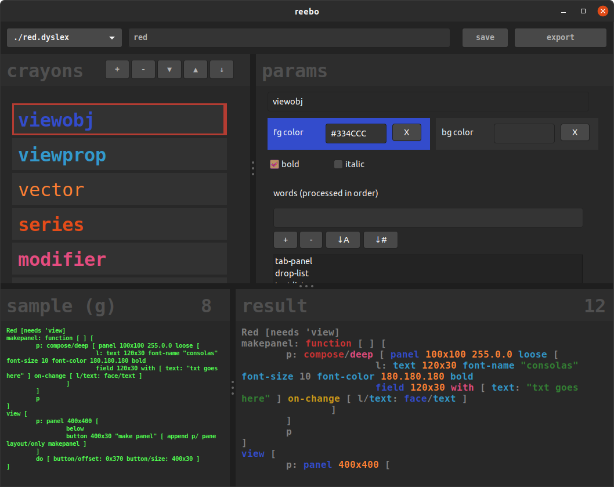

# reebo
interactive syntax highlighting

primarily an excercise in modifying code at runtime, parsing and batch build/destroy ui items.

assume its busted unless there's a compiled binary

# todo
- [ ] investigate exposing tab-width for gtk area widget
- [ ] finish red .dyslex file
- [ ] investigate background color for rich-text, without drawing boxes!
- [ ] add an exporter for Geany (find a compatible lexer 1st that works with semicolon comments and square brackets)
- [ ] add an exporter for emacs (probably based on lisp major mode, with overrides)
- [ ] investigate desktop-environment theme compatibility
