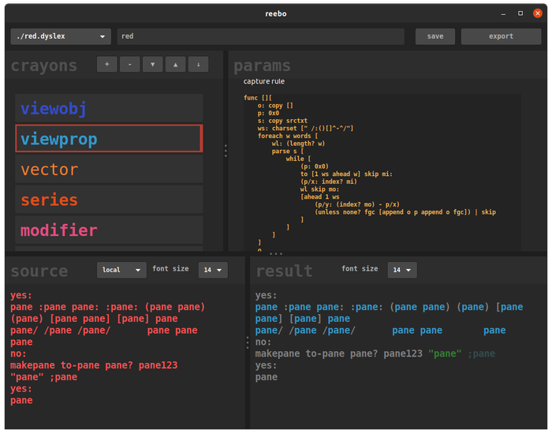

# reebo
primarily a (frustrating) excercise in modifying code at runtime, as well as learning parse

assume its busted unless there's a compiled binary

# todo
- [ ] save source sample in .dyslex file... somewhere

then the boring stuff:
- [ ] investigate drag reordering of crayons
- [ ] investigate exposing tab-width for gtk area widget
- [ ] finish red .dyslex file
- [ ] add bold & italic for the rich-text field
- [ ] investigate background color for rich-text, without drawing boxes!
- [ ] add an exporter for Geany (find a compatible lexer 1st that works with semicolon comments and square brackets)
- [ ] add an exporter for emacs (probably based on lisp major mode, with overrides)
